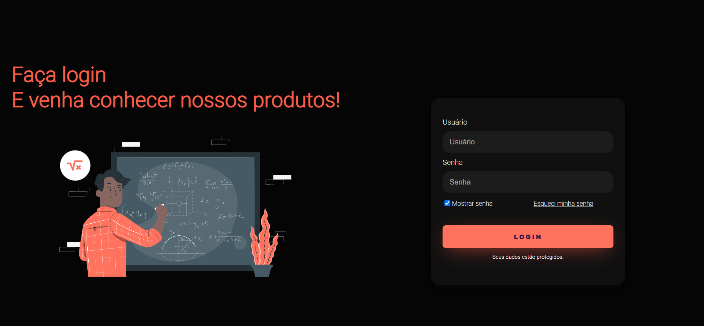
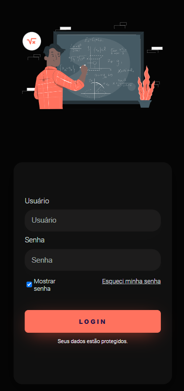

<h1 align="center"> 🟠 Tela de Login 🟠 </h1>

Interface desenvolvida para plataformas que necessitam de uma tela de login!

 <a href="#recursos">Recursos</a> •
 <a href="#tecnologias">Tecnologias</a> • 
 <a href="#status">Status</a> • 
 <a href=#imagens"> Imagens </a> • 

### Status

<h4 align="center"> 
	🎯  🚀 Projeto Concluído! 🎯
</h4>

### Recursos

- [x] Interface Front-End
- [x] Animações;
- [x] Responsive;

### 🛠 Tecnologias

As seguintes ferramentas foram usadas na construção do projeto:

- [HTML](https://pt.wikipedia.org/wiki/HTML/)
- [CSS3](https://pt.wikipedia.org/wiki/CSS3/)

### Imagens

Versão Responsive: 

